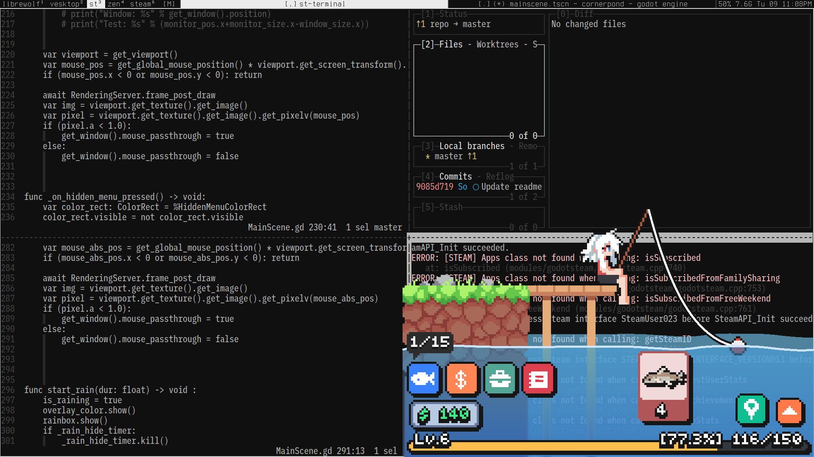

**I couldn't get Steam support to work, see [TODOs](TODO.md)**

# Guide

## Native build

- Download and extract https://github.com/GDRETools/gdsdecomp/releases/download/v2.0.0-beta.2/GDRE_tools-v2.0.0-beta.2-linux.zip
- Run `gdre_tools.x86_64`, RE Tools > Recover Project... and choose `Cornerpond.exe`
- Export in folder of choice and install GDExtensions
- Download and extract (1)https://github.com/GodotSteam/GodotSteam/releases/download/v4.15/linux64-g441-s162-gs415.zip and (2)https://github.com/GodotSteam/GodotSteam/releases/download/v4.15/godotsteam-g441-s162-gs415-templates.zip
- Run `godotsteam.441.editor.linux.x86_64` from (1) (you have to make it executable with `chmod +x godotsteam.441.editor.linux.x86_64`)
- Import the decompiled folder
- Project > Export... > Add... Linux Preset
- Enable Advanced Options. Choose the corresponding Custom Templates (of the form `godotsteam.441.*.template.linux.x86_64`) from (2)
- Choose an (3)Export Path then Export All.... Release mode is recommended for best performance.

You can now run the native executable.

## Clickthrough support

- Run
  `patch <decomp path>/Scripts/MainScene.gd MainScene.gd.patch`
- Re-Export the project

\[**NOTE**\] The clickthrough support is supposed to be cross-platform but I haven't tested.

# Troubleshooting

- The background is solid black: this means you don't have a compositor running. Install [Picom](https://github.com/yshui/picom)
- The focus gets stolen by the game: go to Export Settings > Display > Window and enable No Focus
- For tiling window manager users: you might wanna create a rule to unmanage the game
